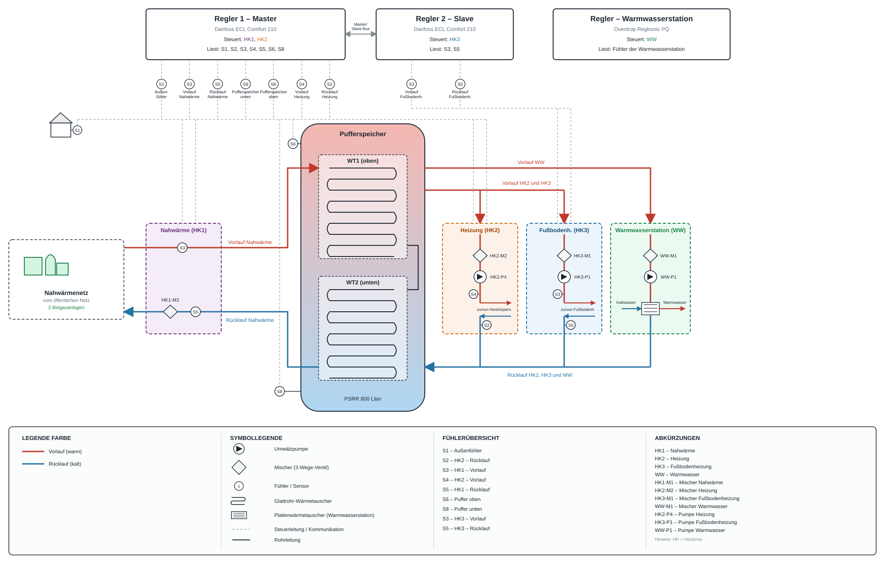

# Heizungsanlage – Systemaufbau und Schema

*(Mehrfamilienhaus, Nahwärmeversorgung)*

## 1. Übersicht

Das Mehrfamilienhaus wird über ein **Nahwärmenetz** versorgt, das seine Wärme aus zwei Biogasanlagen bezieht. Die Nahwärme lädt **indirekt** über einen im Pufferspeicher eingebauten Wärmetauscher den zentralen **Pufferspeicher**. Aus dem Puffer werden zwei getrennte Verbraucherzweige versorgt:

- **Warmwasser (WW)** über eine externe, eigenständig geregelte Frischwasserstation
- **Heizung (HK2) und Fußbodenheizung (HK3)**, die sich einen gemeinsamen Vorlauf-Abzweig aus dem Puffer teilen, aber jeweils eigene Mischer/Pumpen haben

Alle drei Verbraucher (WW, HK2, HK3) münden in **einen gemeinsamen Rücklauf** zurück in den Puffer.

Das vollständige P&ID-Diagramm der Anlage (Regler-Zuordnung, Fühler-/Aktor-Legende, Rohrführung):

*(Bilddatei liegt im Repo unter `img/heizungsanlage_scheme.svg`, dieses Dokument unter `docs/Heizung/heizungsanlage_schema.md` – der relative Pfad `../../img/...` geht zwei Ebenen hoch bis zum Repo-Root und dann in `img/`.)*

## 2. Pufferspeicher

- Typ: **PSRR 800 Liter**, Baujahr 2011, Serien-Nr. 10699, Made in Germany
- Behälter: zulässiger Druck 6 bar (max), zulässige Temperatur 95 °C
- Enthält **zwei Glattrohrwärmetauscher (WT1 oben, WT2 unten)**, zulässiger Druck 6 bar, zulässige Temperatur 110 °C
- Die beiden Wärmetauscher sind **intern in Reihe geschaltet**: der untere Anschluss von WT1 ist mit dem oberen Anschluss von WT2 verbunden (Jumper), sodass beide zusammen wie ein einziger, langer Wärmetauscher wirken.
- Die externen Nahwärme-Anschlüsse liegen entsprechend am **oberen Anschluss von WT1** (Vorlauf, von der Nahwärme kommend) und am **unteren Anschluss von WT2** (Rücklauf, zurück zum Nahwärmenetz).
- Zusätzlich zwei **Anlegefühler** außen am Behälter zur Überwachung der Schichtung im Puffervolumen selbst (unabhängig vom Wärmetauscher-Kreislauf): Puffer oben und Puffer unten.

## 3. Wer regelt/liest was – Übersicht

| Kreis | Funktion | Regler | Liest (Fühler) | Regelt (Aktoren) |
|---|---|---|---|---|
| HK1 | Nahwärme-Ladekreis (Wärmetauscher WT1+WT2) | Regler 1 – Master | Vorlauf (in WT1), Rücklauf (aus WT2), Außenfühler | Mischer im Rücklauf (Rücklaufbegrenzung), keine Pumpe |
| – | Pufferüberwachung oben/unten | Regler 1 – Master | Puffer oben, Puffer unten | nur Anzeige, keine aktive Regelfunktion |
| HK2 | Heizung (Heizkörper) | Regler 1 – Master | Vorlauf, Rücklauf | Mischer + Umwälzpumpe |
| HK3 | Fußbodenheizung | Regler 2 – Slave | Vorlauf, Rücklauf | Mischer + Umwälzpumpe |
| WW | Warmwasser | Externe Frischwasserstation (eigener Regler) | eigene Fühler der Station | eigene Aktorik der Station |

Regler 1 (Master) und Regler 2 (Slave) sind über einen internen Bus gekoppelt; der Slave bezieht die Außentemperatur vom Master. Die Frischwasserstation ist ein eigenständiges Gerät, komplett unabhängig von den beiden Heizungsreglern.

## 4. Nahwärme-Ladekreis (HK1)

Lädt den Pufferspeicher indirekt über die in Reihe geschalteten Wärmetauscher WT1+WT2 (siehe Abschnitt 2).

- Ein Mischer sitzt im Rücklauf zwischen Wärmetauscher-Ausgang (WT2 unten) und der Rücklaufleitung zum Nahwärmenetz. Er regelt die Rücklauftemperatur zum Netz (Rücklaufbegrenzung).
- **Keine eigene Umwälzpumpe** – der erforderliche Durchfluss wird durch das Nahwärmenetz selbst bereitgestellt (Netzdruck).
- Zwei Fühler: einer misst den Vorlauf (Eintritt in WT1, oben), einer den Rücklauf (Austritt aus WT2, unten, zurück zum Netz).

## 5. Heizkreis HK2 – Heizung (Heizkörper)

Eigener Vorlauf-Abzweig aus dem Puffer (gemeinsam mit HK3 geführt bis kurz vor die jeweiligen Mischer), gemischter, geregelter Heizkreis für die Heizkörperheizung.

- Mischer + Umwälzpumpe
- Zwei Fühler: Vorlauf und Rücklauf

## 6. Heizkreis HK3 – Fußbodenheizung

Eigener Regler (Slave), teilt sich den Vorlauf-Abzweig aus dem Puffer mit HK2.

- Mischer + Umwälzpumpe
- Zwei Fühler: Vorlauf und Rücklauf

## 7. Warmwasser (WW)

Eigener Vorlauf-Abzweig aus dem Puffer, unabhängig von HK2/HK3, mündet aber in denselben gemeinsamen Rücklauf zurück in den Puffer.

- Geregelt über eine externe Frischwasserstation (Plattenwärmetauscher-Prinzip, Kaltwasser rein / Warmwasser raus im Durchlaufprinzip)
- Nicht Teil der Heizungsregler-Regelung; eigener Regler mit eigener Sensorik

## 8. Offene Punkte

- Sollwerte, Heizkurven-Parameter und Rücklaufbegrenzungs-Einstellungen stehen noch aus (siehe separates Dokument zur Reglerkonfiguration).
